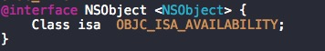

##NSObject

####组成
在OC中有两个NSObject,一个是类，另外一个是协议，其中NSObject类采用了NSObject协议。

上面的成员变量`Class isa`指向的是NSObject实例的所属类，在这里指向`元类(meta)`,详情请查找OC的对象模型
[OC的对象模型](http://www.liuchendi.com/2014/08/26/iOS/3_runtime/)

####load和initialize方法

详情请查看[load和initialize区别](http://www.liuchendi.com/2014/09/10/iOS/5_load_initialize/)

####对象的生命周期

#####对象分配
NSObject提供了两个对象分配空前的方法，都是类方法
	
	+ (instancetype)allocWithZone:(struct _NSZone *)zone;
	+ (instancetype)alloc;

[官方文档](https://developer.apple.com/library/mac/documentation/Cocoa/Reference/Foundation/Classes/NSObject_Class/index.html#//apple_ref/occ/clm/NSObject/allocWithZone:)里面有这么一段话可以解释`allocWithZone`存在是因为历史的原因

	This method exists for historical reasons; memory zones are no longer used by Objective-C.
	
所以就不研究这里面到底是做了什么，可以猜测在alloc实现里面应该会继续调用allocWithZone方法。

#####对象初始化

默认提供了一个`init`的初始化方法、还有一个`new`的初始化方法
	
	- (instancetype)init;
	+ (instancetype)new;

两者的区别是通过new创造出来的对象只能通过init进行初始化，在自己定义的类中，往往可以自定义初始化方法。子类在初始化的过程中需要调用父类的初始化方法。

#####拷贝

拷贝可以分为`"深拷贝"`和`"浅拷贝"`,深拷贝拷贝的是对象的值，拷贝前和拷贝后的两个对象互不影响。浅拷贝拷贝的是对象的引用，无论修改哪个变量都将影响另外一个对象的值

copy和mutableCopy的区别：从字面上来说copy的拷贝操作具有不可变性，而mutableCopy的拷贝操作对象具有可变性。

下面的声明方式是有问题的

	@property (copy) NSMutableArray *array;
因为调用的时候self.array ,数组其实是不可变的，如果再调用`addObject`的话，就会崩溃,可变数组已经变成了`__NSArrayI`类型的了
	
	-[__NSArrayI addObject:]: unrecognized selector sent to instance 0x787664e0
	
#####消息调用

