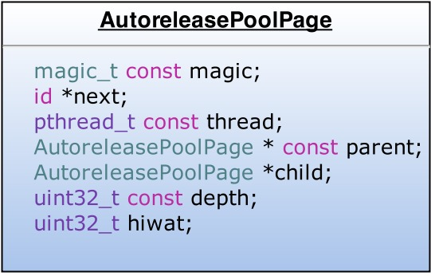
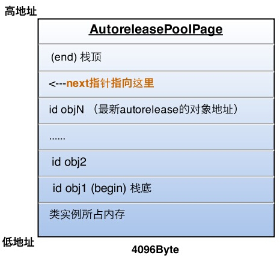
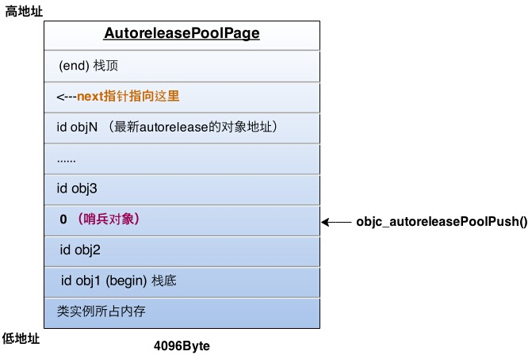
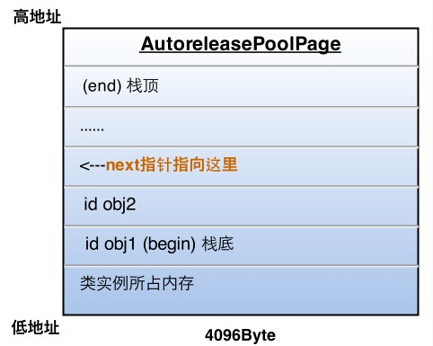

##Autorelease

1、释放的时机。在没有手动加Autorelease Pool的情况下，Autorelease是在当前的runloop迭代结束的时候释放，能够释放的原因是，系统在每个runloop迭代中加入了自动释放池push和Pop

##原理
我们使用@autoreleasepool{}来使用一个AutoreleasePool,其实就是`objc_autoreleasePoolPush();`

AutoreleasePoolPage



*	AutoreleasePool没有单独的结构，由若干个`AutoreleasePoolPage`以双向列表的形式组合而成分别对应parent和child指针。
*	AutoreleasePool是按线程一一对应的,(thread指针指向当前线程)
*	`AutoreleasePoolPage`每个对象会开辟`4096`字节内存，虚拟内存一页的大小，除了上面实例变量所占的空间，剩下的全部用来存储autorelease对象的地址
*	`id *next` 指针作为游标指向栈顶最新添加进来的autorelease对象的下一个位置
*	一个AutoreleasePoolPage空间被占满时，会新建一个`AutoreleasePoolPage`对象，连接链表，后来的autorelease对象都在新的page中加入。


记录Autorelease对象地址内存


向一个对象发送`- autorelease`消息，就是将这个对象加入到当前AutoreleasePoolPage的栈顶next指针指向的位置

##释放时刻
每当进行一次objc_autoreleasePoolPush调用时，runtime向当前的AutoreleasePoolPage中add进一个哨兵对象，值为0（也就是个nil），那么这一个page就变成了下面的样子：



objc_autoreleasePoolPush的返回值正是这个哨兵对象的地址，被objc_autoreleasePoolPop(哨兵对象)作为入参，于是：

1.根据传入的哨兵对象地址找到哨兵对象所处的page

2.在当前page中，将晚于哨兵对象插入的所有autorelease对象都发送一次- release消息，并向回移动next指针到正确位置

3.补充2：从最新加入的对象一直向前清理，可以向前跨越若干个page，直到哨兵所在的page

刚才的objc_autoreleasePoolPop执行后，最终变成了下面的样子：


##嵌套的AutoreleasePool

知道了上面的原理，嵌套的AutoreleasePool就非常简单了，pop的时候总会释放到上次push的位置为止，多层的pool就是多个哨兵对象而已，就像剥洋葱一样，每次一层，互不影响

##Autorelease返回值的快速释放机制
```
	+ (instancetype)createSark { 
    return [self new];  
	} 
	// caller 
	Sark *sark = [Sark createSark]; 
```

```
	+ (instancetype)createSark { 
    id tmp = [self new]; 
    return objc_autoreleaseReturnValue(tmp); // 代替我们调用autorelease 
	} 
// 代替我们调用retain 
id tmp = objc_retainAutoreleasedReturnValue([Sark createSark]) 
Sark *sark = tmp; 
objc_storeStrong(&sark, nil); //调用了release
```
##TLS线程局部存储
将一块内存作为某个线程专有的存储，以key-value形式读写。

返回值上调用`objc_autoreleaseReturnValue`，将这个返回值object存放在TLS中，然后直接返回这个object(不调用autorelease)；同时，在外部接收这个返回值的`objc_retainAutoreleasedReturnValue`里，发现TLS里面正好有这个对象，所以直接返回这个object，不调用retain.所以调用方和被调用方利用TLS做中转，免去了对返回值的内存管理。

